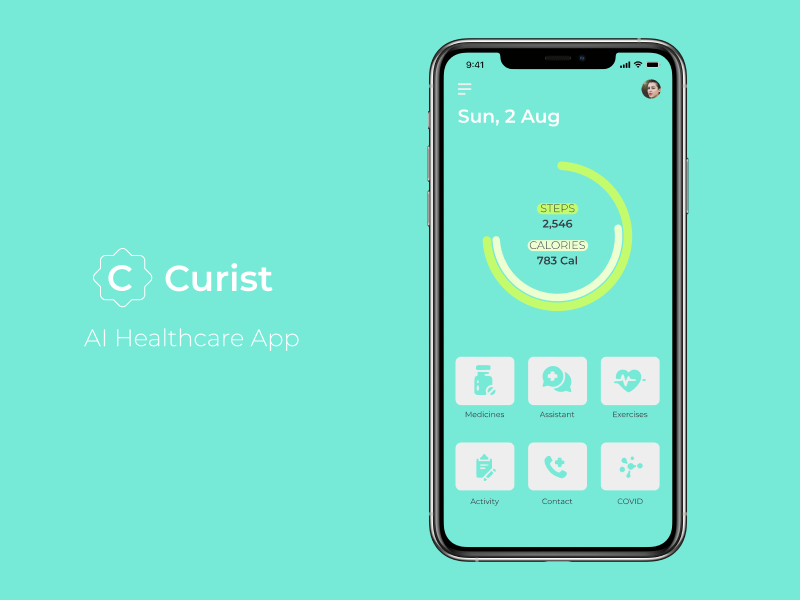
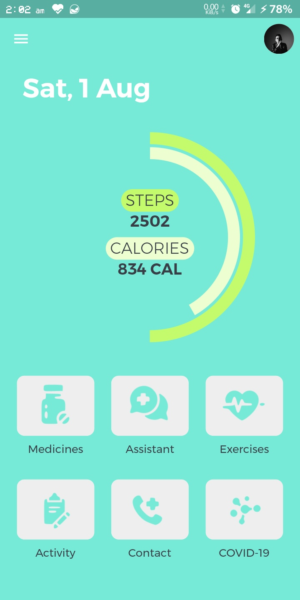
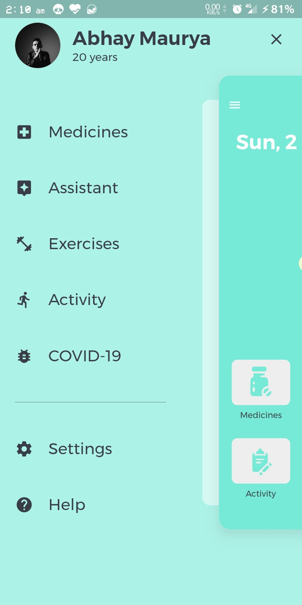
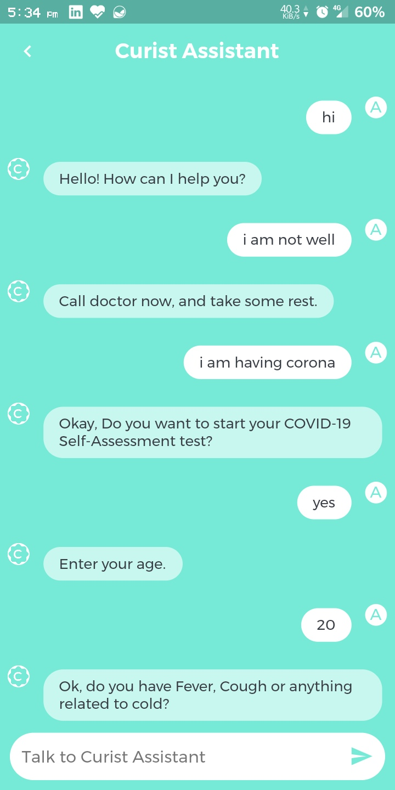
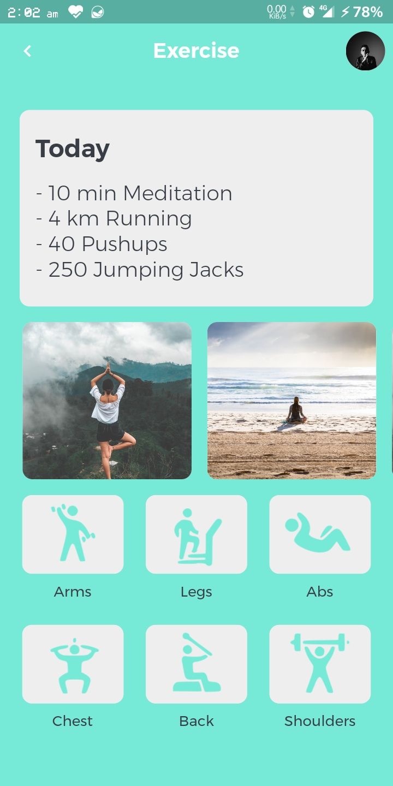
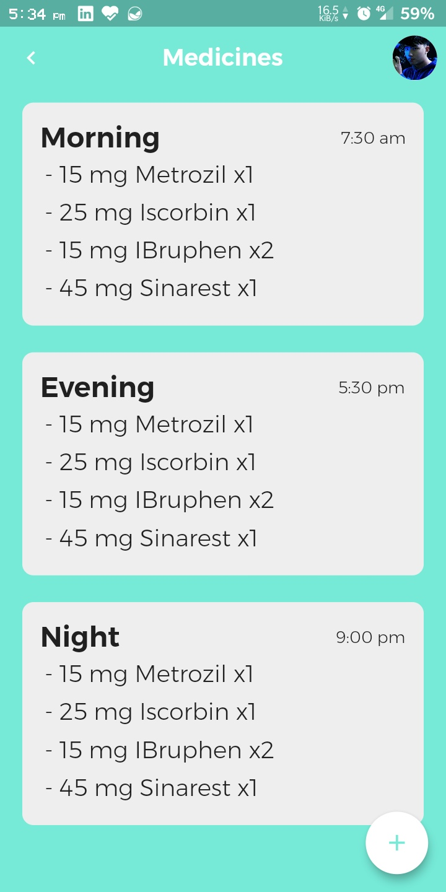
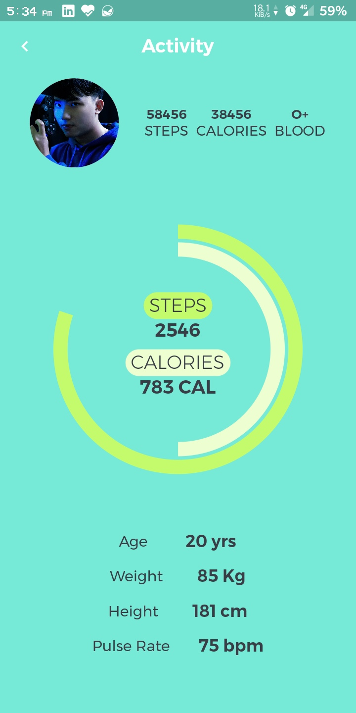
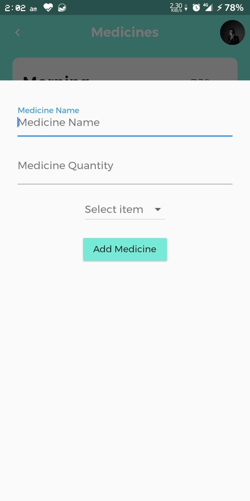
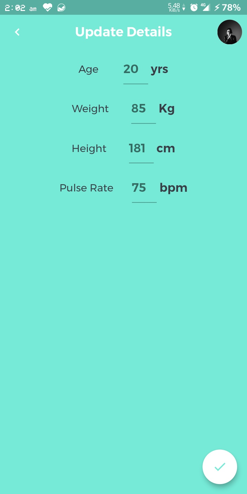

#  Curist - An AI Healthcare App

**HACK THE HOURGLASS**
**IDEA SUBMISSION**

## Screenshots

|  |  |  |
| :-------------: | :-------------:  | :-------------:  |
|     Home     |    Main Drawer    |    Assistant    |

|  |  |  |
| :-------------:  | :-------------:  | :-------------:  |
|     Exercises       |     Medicines     |     Activity     |

|  |  |
| :-------------:  | :-------------:  |
|     Add Medicines      |     Update Details     |

Application link [here](https://github.com/Hash-Studios/healthapp/releases/download/v0.5/app-arm64-v8a-release.apk)
## Track - Healthcare

## Problem Description
In today's world when a pandemic is upon us, and healthcare is limited to the non-digital platforms, it is not very convenient to reach to a doctor for reasons like migraine, stomach ache, etc. Also, these issues require quick and reliable solution immediately.
Also, sometimes people tend to forget to take medicines. During this pandemic, this can result in terrific losses.
There are some solutions to these problems but they are not very reliable and engaging.

## Solution Description
The solution to the above-discussed problem we came with is Curist.
Curist is an AI Healthcare app.
Curist can help people manage all of their healthcare needs through a single platform. Curist can help people by reminding them to take their medicines on time. It can also help them by managing their exercise schedule. It can also help them by evaluating self-assessment tests. Curist has an in-built assistant which can also help people by advising them precautions and tips so they can stay healthy. Curist Assistant can engage in small talk and can recommend diet, exercises, yoga asanas, etc. Curist also tracks a user’s activity and can alert them when they are not very active.
Curist focuses on the “Aatmanirbhar Bharat” plan of the Government by making its users self-reliable and motivates them for the same.

## Work Done So Far
We have successfully completed half of our development schedule.
In this -
We have designed UI/UX of the prototype app.
We have made the UI into an app using Flutter
We have successfully integrated Curist Assistant into the app.
We have trained DialogFlow for multiple health-related conversations.
We have also added Local User Data Storage.
We have also added complex animations.
We have added support and contact helplines.
We have added medicines database and notification.
We have added new illustrations.
We have added null-safety.

## Challenges we ran into
Complex yet engaging UI was needed, to lift the mood of the user so that they feel good after using the app. So it was a challenge to actually create this UI with excellent user experience.
For creating the user interaction for assistant/chatbot, we needed to know how a person having some disease will behave for that we researched a lot, to actually give the initial response to the bot which were then used for the model training.
It was also our first project using Dialogflow so we had to learn how to actually set it up working with Flutter.
We also had problems setting up pedometer with Flutter. As only single package of pedometer is available on pub.dev, which is not compatible with AndroidX, we had to skip pedometer in release build, but it is working in debug build.

## Plan for next 12 hours:
**Update**
What we had planned initially, we have completed it.

These things are completed -

~~Working pedometer and calories detection.~~

~~Actually, store user data i.e. medicines and user’s personal data like weight, height, etc.~~

~~We have to also implement the settings and the exercises page of the app.~~

~~We have to also test the app for visual bugs and glitches.~~

~~We have to also implement the wger REST API for the exercises so that we can fetch new and updated exercises along with their caloric information

~~Finish the medicines’ part of the app with notifications and reminders.

## Application of the solution
The app can be used to help people by reminding them to take their medicines on time. It can also help them by managing their exercise schedule. It can also help them by evaluating self-assessment tests. Curist has an in-built assistant which can also help people by advising them precautions and tips so they can stay healthy. Curist Assistant can engage in small talk and can recommend diet, exercises, yoga asanas, etc. Curist also tracks a user’s activity and can alert them when they are not very active.

## Technology used and its purpose:
Flutter: Flutter was used as the main UI Framework upon which the complete solution was built.

Dart: It is the main programming language that was used in developing the Curist app.

Hive: It is a local NoSQL Database which is extremely fast and reliable. We have used Hive to store all the data required by our App.

DialogFlow: It is a natural language understanding platform for integrating conversational UI into any app. We used it for the same.

Firebase: It is a complete app management toolkit by Google. We used it to manage DialogFlow and to save some data on the cloud.

Figma: It is a UI/UX Designing software which we used to design the Curist App.

## Uniqueness of the idea
The idea although is similarly implemented by many other Mobile phone apps, but is never more relevantly implemented like in Curist. Curist brings the qualities of multiple apps onto a single platform.
Also, the app implements self-reliability as it encourages Government’s plan of “Aatmanirbhar Bharata”, which is missing in other implementations.

## Project Links

GitHub Repository Link
[https://github.com/Hash-Studios/healthapp](https://github.com/Hash-Studios/healthapp)

Video Link
[https://youtu.be/e64s2QoEd9w](https://youtu.be/e64s2QoEd9w)

Application Link
[demo/app-arm64-v8a-release.apk](https://github.com/Hash-Studios/healthapp/releases/download/v0.5/app-arm64-v8a-release.apk)

## License

Curist is released under BSD 3-Clause License. [See License](https://github.com/Hash-Studios/healthapp/blob/master/LICENSE) for details.
